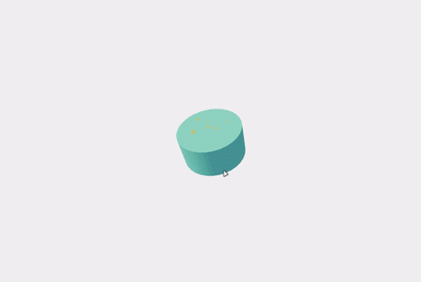

## ⭐ About
This is a simple project to show how Three.js works on React, using React Three.js and Drei.

## 📚 Learnings
- How to set: scene, camera, object, light and render on React Three.js and Drei
- Animations and controls
- Mesh

## 🚀 Technologies/Tools
- Three.js
- JavaScript
- Node Package Manager (NPM)
- Vite
- React Three
- Drei

## 🎥 Project


## ▶️ Running
Clone the project with:
```bash
  git clone https://github.com/DevBonatto/3DProject-React
```

Then acesses the past that you just created:
```bash
  cd 3DProject-React
```

Then use this command to install the dependencies:
```bash
  npm install
```

Develop start
```bash
  npm run dev
```
